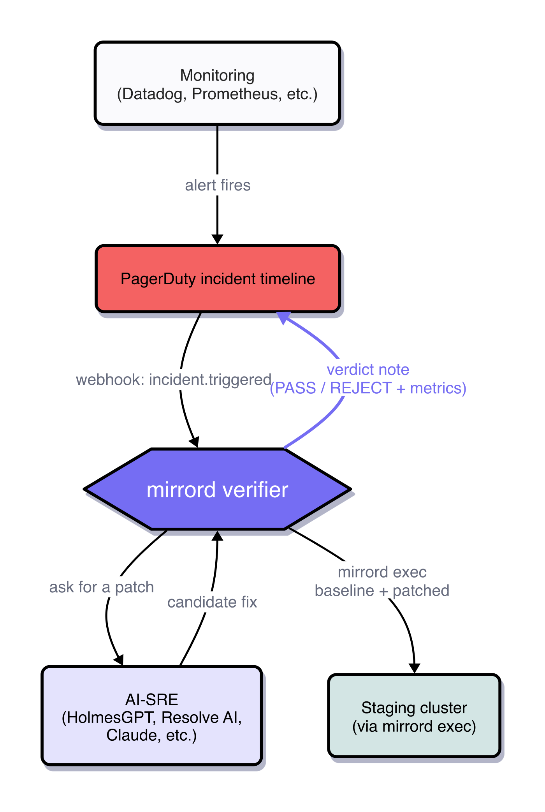

# pagerduty-mirrord-verifier

**Verify AI-SRE fixes against your real staging cluster, on the PagerDuty incident timeline.**

When an AI-SRE (PagerDuty Advance, HolmesGPT, Resolve AI, incident.io's Investigator, or a homegrown Claude loop) proposes a code fix for a firing incident, this service runs the patch against your real staging cluster via `mirrord exec` and posts a PASS/REJECT verdict as a note on the same PagerDuty incident. The on-call human sees the AI's proposal and mirrord's verdict side-by-side on the incident timeline, without leaving PagerDuty.

## Architecture



1. Monitoring fires an alert into PagerDuty.
2. PagerDuty sends the `incident.triggered` webhook to the verifier.
3. Verifier asks the AI-SRE for a candidate fix.
4. Verifier applies the fix to a working copy of the service code and runs both the unpatched and patched versions under `mirrord exec` against the target deployment. Same real downstream services, same network identity, same env — only the patch differs.
5. Verifier compares baseline vs patched, decides PASS or REJECT, posts the proof bundle as a note on the originating PagerDuty incident.

The verifier is the AI-SRE-agnostic middle layer. The demo in this repo uses a small Claude call as the AI-SRE stand-in; production use would wire it to whatever AI-SRE the customer runs.

## What's in the repo

| Path | Purpose |
|---|---|
| `src/verifier/webhook.py` | FastAPI receiver for PagerDuty V3 webhooks (HMAC-SHA256 signature verification, `incident.triggered` / `incident.annotated` parser). Also has Datadog and Alertmanager parsers left over from the underlying engine — inert unless routed. |
| `src/verifier/orchestrator.py` | The bridge: Claude call that turns an incident's context into a structured code patch. |
| `src/verifier/engine.py` | Verification orchestrator: apply patch → run baseline + patched via `mirrord exec` → compare → emit proof bundle. |
| `src/verifier/mirrord_runner.py` | Wraps `mirrord exec`, captures stdout/metrics. Falls back to `LOCAL-ONLY` simulated metrics when `MIRRORD_TARGET` is unset. |
| `src/verifier/poster.py` | `PagerDutyIncidentNotePoster`: posts the proof bundle as a note on the originating incident via REST API. Guarded against self-annotation feedback loops. |
| `src/verifier/proof_bundle.py` | Renders the bundle as markdown (what lands on the incident). |
| `sample-app/` | Toy `checkout` + `pricing` services with a planted latency bug for the demo. |
| `scenarios/` | Prepared patches (hand-crafted good, hand-crafted bad, Claude-proposed) for reproducible demo runs. |
| `deploy/verifier.yaml` | Kubernetes manifest for running the verifier in-cluster. |

## Quick start

```bash
make install       # creates a venv with dependencies
cp .env.example .env
# fill in .env — see below
make serve         # runs the webhook receiver on port 8000
```

Required env vars in `.env`:

| Var | Purpose |
|---|---|
| `PAGERDUTY_REST_API_KEY` | Non-read-only API key. Used to post notes on incidents. Create at Integrations → API Access Keys. |
| `PAGERDUTY_WEBHOOK_SIGNING_SECRET` | Secret from the PD Webhook V3 subscription. Used to verify inbound webhook HMAC-SHA256. |
| `PAGERDUTY_FROM_EMAIL` | Any valid PD user email in your account. Required by PD's `From` header when posting notes. |
| `ANTHROPIC_API_KEY` | For the bridge (Claude call that produces the patch). Not needed if you're only running the prepared-patch demo scenarios. |
| `MIRRORD_TARGET`, `MIRRORD_NAMESPACE` | Optional. Point at your staging cluster's target deployment. Without these, the runner emits simulated metrics. |
| `VERIFIER_SAMPLE_REPO` | Path to the service's code checkout that the verifier should patch. For the demo, point at `sample-app/`. In production this would be resolved from a service → repo catalog. |
| `PREPARED_PATCH_FILE` | Optional. Path to a scenario JSON. If set, the verifier skips the Claude call and uses the prepared patch. Used to make demo PASS runs deterministic. |

## Wiring the PagerDuty side

1. Create a service in PagerDuty (e.g. `mirrord-demo-checkout`).
2. **Integrations → API Access Keys** → create a non-read-only key. This is `PAGERDUTY_REST_API_KEY`.
3. **Integrations → Generic Webhooks (V3) → New Webhook**:
   - Delivery URL: `https://<your-verifier>/webhook/pagerduty` (during dev, an `ngrok http 8000` URL works)
   - Scope: the service you created
   - Event Subscriptions: `incident.triggered`, `incident.annotated`
   - Save the signing secret shown → this is `PAGERDUTY_WEBHOOK_SIGNING_SECRET`.

## Running the demo

Two scenarios ship in `scenarios/`, mirroring [Part II of the MetalBear AI-SRE post](https://metalbear.com/blog/ai-sre-holmesgpt/):

- **Scenario 1 (PASS)** — `scenario-1-fix-works-offline.json`: hand-crafted short client-side timeout on `fetch_price()`. Fast-fails under the SLO, patched p99 well below baseline, verdict PASS.
- **Scenario 2 (REJECT)** — `scenario-2-fix-fails.json`: hand-crafted overly-generous timeout that doesn't clear the latency tail. p99 barely moves, verdict REJECT.

To trigger a demo run:

```bash
# Terminal 1: run the verifier with a prepared patch
PREPARED_PATCH_FILE=scenarios/scenario-1-fix-works-offline.json make serve

# Terminal 2: fire a test incident on your PD service
curl -sS -X POST https://api.pagerduty.com/incidents \
  -H "Authorization: Token token=$PAGERDUTY_REST_API_KEY" \
  -H "From: $PAGERDUTY_FROM_EMAIL" \
  -H "Accept: application/vnd.pagerduty+json;version=2" \
  -H "Content-Type: application/json" \
  -d '{"incident":{"type":"incident","title":"checkout p99 above SLO","service":{"id":"<YOUR_SERVICE_ID>","type":"service_reference"}}}'
```

Watch the verifier logs. In ~2 minutes the verdict note lands on the incident timeline in PagerDuty.

## References

- [Part I: Auto-verifying your AI-SRE's fixes against your real cluster, with mirrord](https://metalbear.com/blog/ai-sre/)
- [Part II: HolmesGPT end-to-end on a real cluster: what passed, what didn't](https://metalbear.com/blog/ai-sre-holmesgpt/)
- [mirrord operator install docs](https://metalbear.com/mirrord/docs/operator/setup/installation)
- [PagerDuty Webhooks V3](https://developer.pagerduty.com/docs/db0fa8c8984fc-overview)
- [PagerDuty REST API — Incidents](https://developer.pagerduty.com/api-reference/9d0b4b12e36f9-create-a-note-on-an-incident)

## License

MIT.
